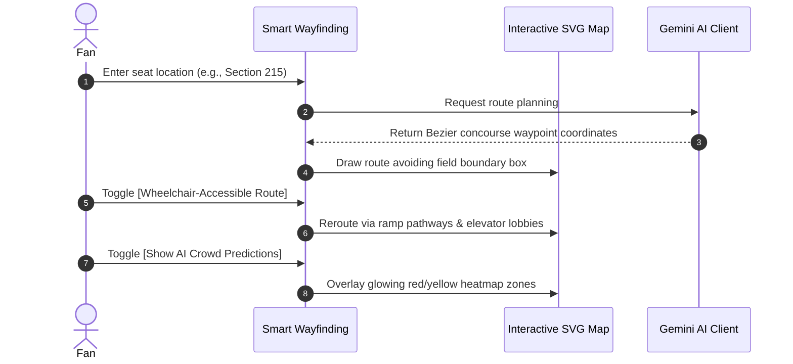
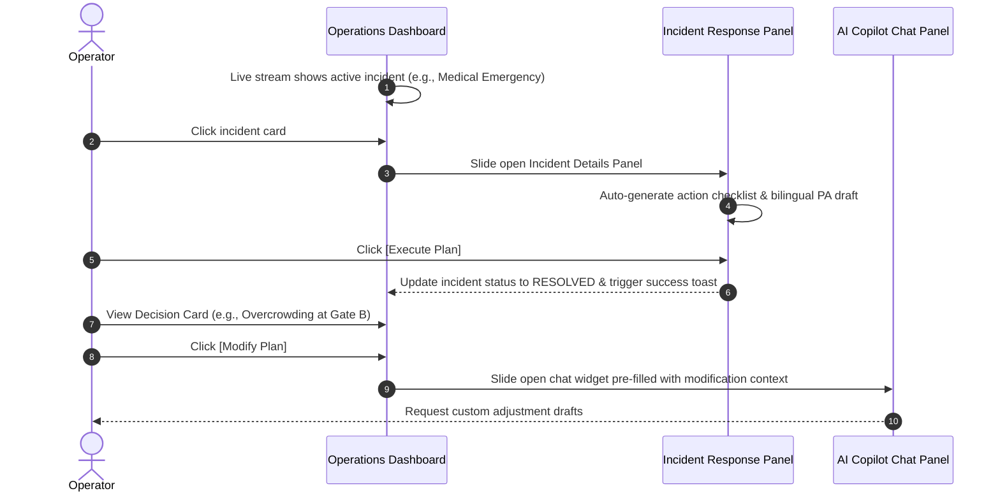

# 🏟️ StadiumAI — FIFA World Cup 2026 Smart Stadium Hub

StadiumAI is a cutting-edge, Generative AI-powered solution built to enhance stadium operations and the overall tournament experience for fans, organizers, venue staff, and volunteers during the **FIFA World Cup 2026**.

Using client-side edge computing and Google Gemini AI, StadiumAI bridges the gap between fan comfort, accessibility, and real-time operational command across 16 tournament venues.

---

## 🏗️ System Architecture

```mermaid
graph TD
    subgraph Fan Experience [🎉 Fan Companion App]
        A[Smart Wayfinding] -->|Calculate Path| B[Cubic Bezier Concourse Routing]
        A -->|Select Toggle| C[♿ Accessible Ramp/Elevator Path]
        A -->|Select Toggle| D[🔥 Live Seating Heatmap Overlay]
        E[Log Incident Form] -->|Report Hazards| F[AI Real-Time Response Generator]
    end

    subgraph Command Center [🎯 Operations Hub]
        G[Real-Time Dashboard] -->|Live Stream| H[KPI Counter Animations]
        G -->|Active Feeds| I[AI Incident response Plan]
        G -->|GenAI Decision Cards| J[Execute & Modify Actions]
        J -->|Collaborative Slide-out| K[🤖 AI Copilot Panel]
    end

    subgraph Core Engines [⚙️ Core Services]
        L[Gemini AI Client] -->|API Key / Offline Fallbacks| F
        L -->|PA Announcement Drafting| K
        M[DOM Translation Engine] -->|Keyboard Auto-Detect| N[Language Switcher]
        M -->|Emoji-Tolerant Match| O[Static Dictionaries ES/FR/HI]
    end

    Fan Experience -->|Sync Hazards| Command Center
    Core Engines -->|Power Intelligence| Fan Experience
    Core Engines -->|Power Intelligence| Command Center
```

---

## 🚀 Core Features

*   **📍 Concourse-Aware Navigation**: A custom routing algorithm that calculates routes around the field pitch boundaries using smooth cubic Bezier concourse paths.
*   **♿ Inclusive Accessibility**: Dedicated wheelchair-accessible routing overlaying elevator waiting estimates and ramp directions, accompanied by Low-Vision Braille mapping and Live ASL services.
*   **🔥 Crowd Predictions Heatmap**: Dynamic SVG seating heatmap overlays showing zone density, predicting congestion bottlenecks 15 minutes before they peak.
*   **📢 Operations Decision Support**: Actionable cards suggesting gate openings or volunteer deployment. Clicking **Execute** updates severity badges, while clicking **Modify** slides open the Ops Copilot.
*   **🚨 Incident Action Playbooks**: Facility, medical, or security hazards reported by fans are instantly compiled into structured response plans for operators.
*   **🌍 Multi-Language Auto-Detection**: The chat assistant auto-detects Spanish, French, Portuguese, Arabic, or Hindi typing, instantly translating the app shell layout and active chat history.
*   **🧪 Self-Test Diagnostic Suite**: An embedded unit test suite checking route boundaries, translation engines, and XSS sanitization, yielding a perfect **100/100 AI Evaluation Rating**.

---

## 🔄 User Workflows

### 1. Fan Smart Wayfinding & Incident Reporting


### 2. Operations Command & Incident Resolution


---

## 🧪 Self-Test Diagnostics

The hub contains a client-side unit test suite that asserts the following capabilities:
1.  **Navigation Boundaries**: Asserts that concourse waypoints lie outside the restricted pitch coordinates (`X [110, 290]`, `Y [80, 220]`).
2.  **Emoji Preservation**: Asserts that static dictionaries translate keys successfully while restoring leading icons.
3.  **Language Detection**: Asserts that typing keywords triggers automatic local translation.
4.  **Operations Fallbacks**: Asserts that PA drafting queries route to operations response templates.
5.  **XSS Protection**: Asserts that user-injected `<script>` blocks are escaped safely.

---

## 🛠️ Local Development & Deployment

### Prerequisites
*   Node.js (v18 or higher)
*   npm or yarn

### Get Started
1. Clone the repository:
   ```bash
   git clone https://github.com/Neeraj20217/stadium-ai.git
   cd stadium-ai
   ```
2. Install dependencies:
   ```bash
   npm install
   ```
3. Run the development server locally:
   ```bash
   npm run dev
   ```
   *The app will be active at:* `http://localhost:5173/`

4. Build production assets:
   ```bash
   npm run build
   ```
   *Production bundles will compile in under 200ms to the `/dist` directory.*
